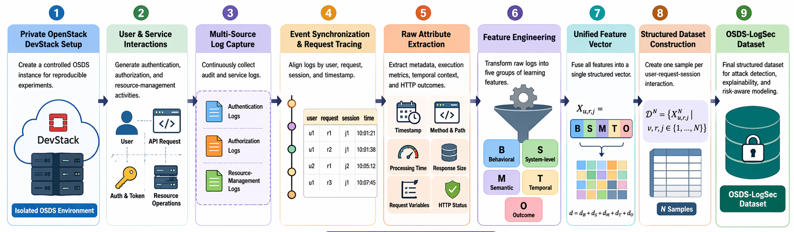
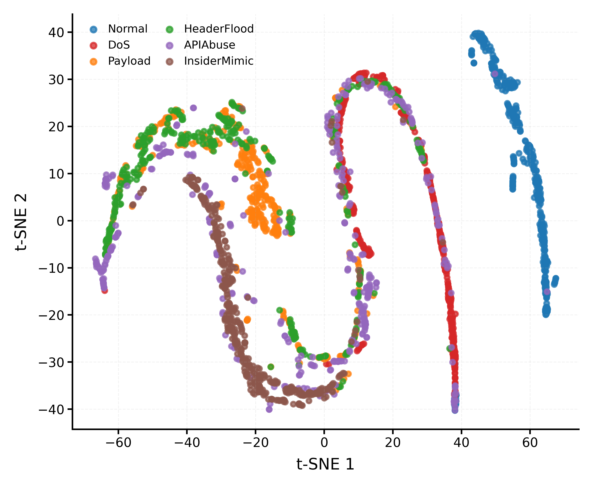
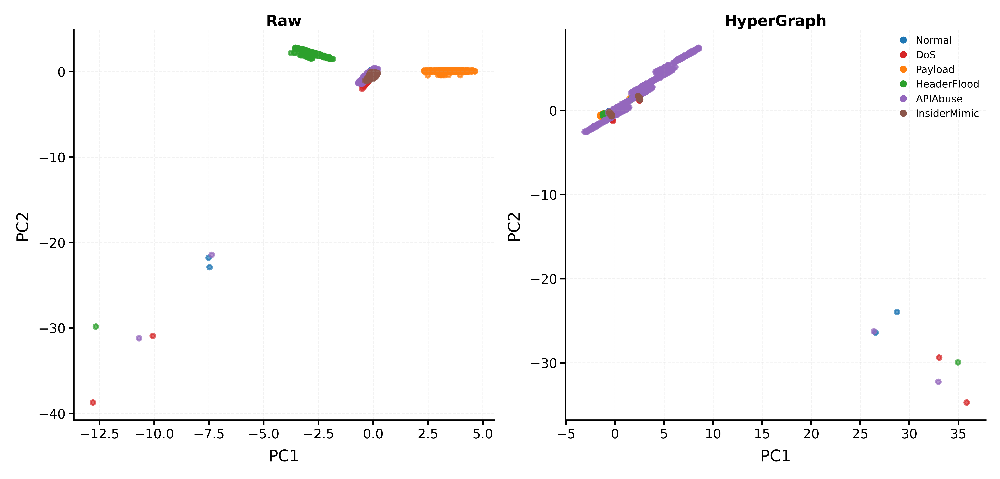
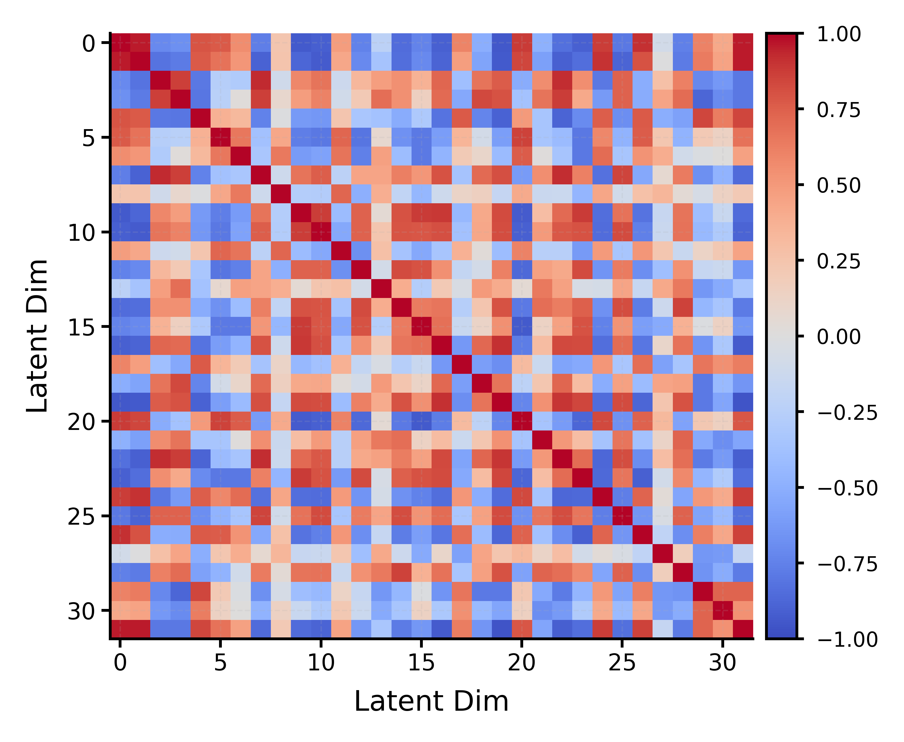
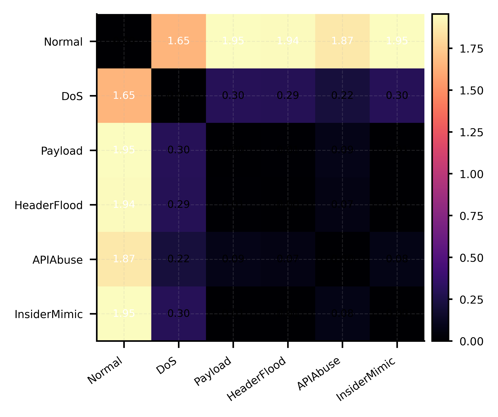
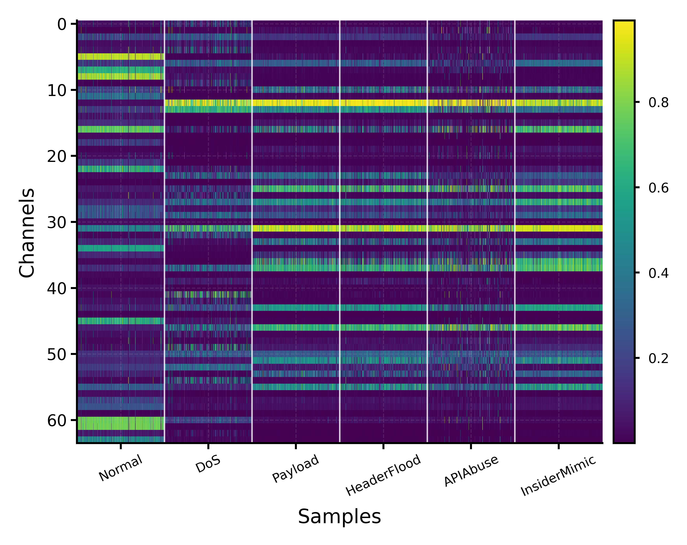
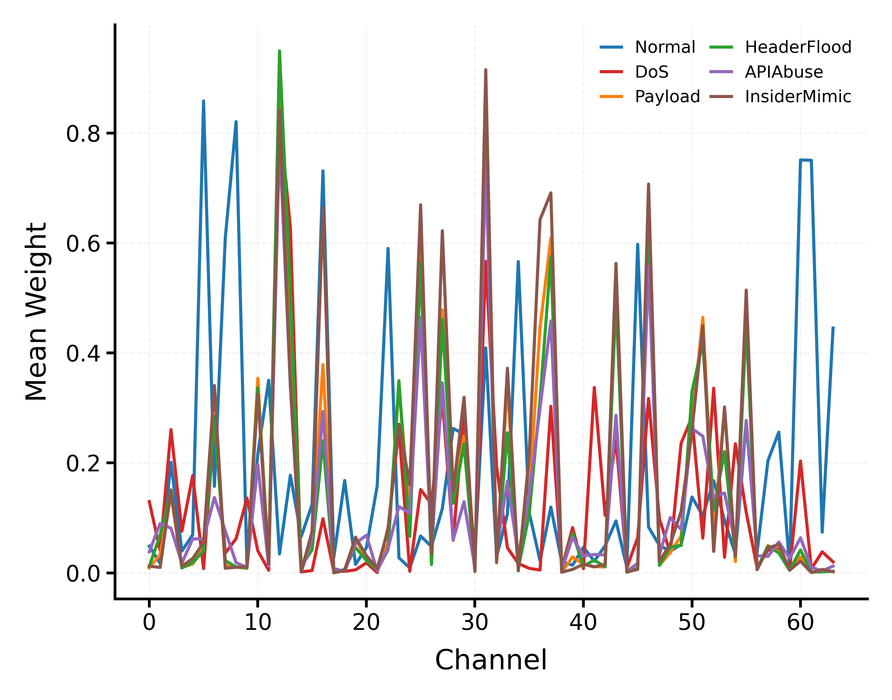
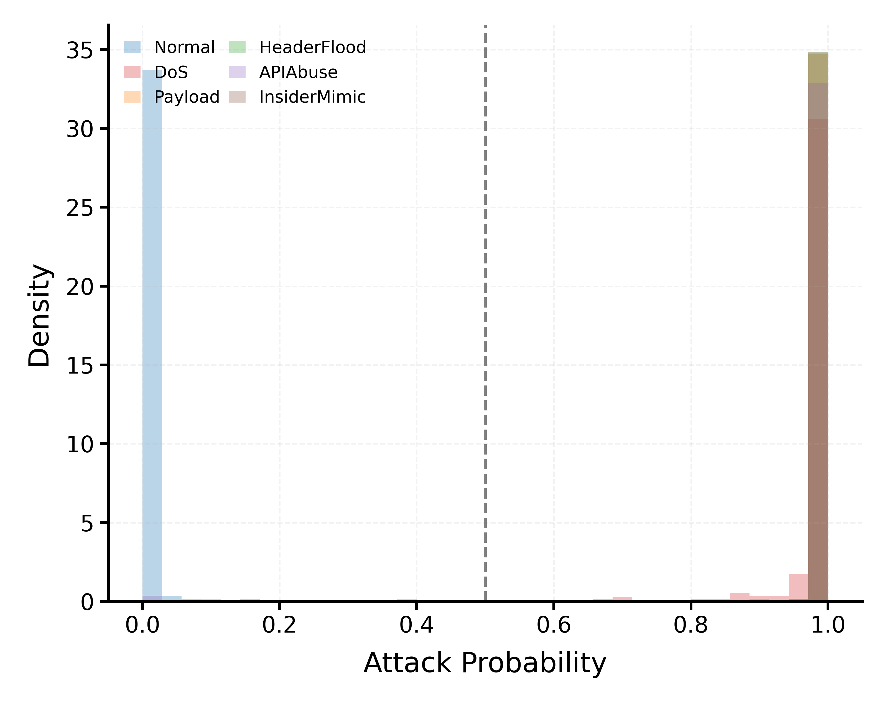
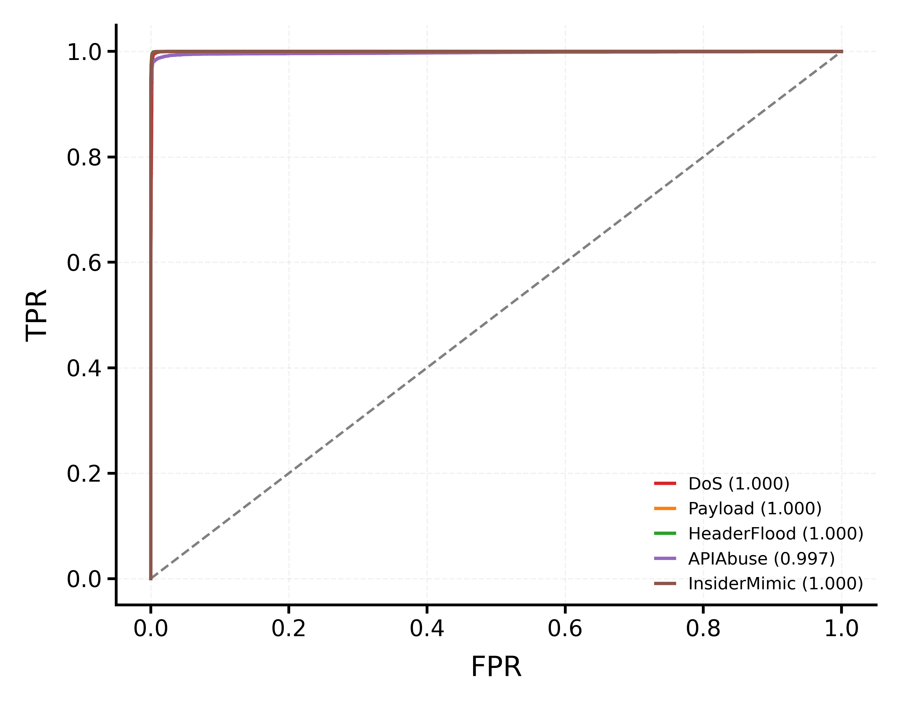

# RAVEN-ADE++

Risk-Adaptive Variational Ensemble Network for Attack Detection and Explainability

## Overview

RAVEN-ADE++ is a cloud-log attack detection framework designed for structured OpenStack service logs. The framework combines HyperGraph-inspired contextual augmentation, supervised variational latent learning, and attention-based risk weighting in one architecture.

The project is built around the proposed OSDS-LogSec dataset, a custom cloud-security dataset collected from a private OpenStack DevStack environment. The dataset contains 444,602 structured request records with balanced normal and attack samples.

The framework is designed for practical cloud monitoring environments where attack behavior often resembles normal activity, appears as low-intensity drift, or spreads across multiple services and request paths.

Paper: RAVEN-ADE++, a Risk-Adaptive Variational Ensemble Network for Attack Detection and Explainability.

---

## Repository Structure

```text
RAVEN-ADE-
│
├── CODE/
│   ├── training scripts
│   ├── evaluation scripts
│   ├── visualization scripts
│   └── baseline implementations
│
├── FIGURES/
│   ├── architecture diagrams
│   ├── dataset workflow figures
│   ├── modulewise_outputs/
│   └── result visualizations
│
├── OSDS-LOGSEC-DATASET/
│   ├── structured dataset files
│   ├── processed CSV files
│   └── feature schema
│
├── RESULTS/
│   ├── trained outputs
│   ├── confusion matrices
│   ├── ROC curves
│   ├── feature importance plots
│   └── ablation studies
│
├── Trained-Models/
│   ├── raven_ade_full.keras
│   ├── raven_light.keras
│   ├── baseline models
│   └── scaler and preprocessing files
│
├── osds_logsec_dataset_collection_workflow.png
├── raven.jpg
├── LICENSE
└── README.md
```

---

## Proposed Contributions

### 1. OSDS-LogSec Dataset

The project introduces the OpenStack DevStack Log Security Dataset (OSDS-LogSec Dataset), a structured cloud-security dataset collected from a private OpenStack DevStack deployment.

The dataset contains:

| Property | Value |
|---|---:|
| Total Samples | 444,602 |
| Normal Samples | 222,302 |
| Attack Samples | 222,300 |
| Raw Features | 18 |
| HyperGraph-Augmented Features | 27 |
| Train Samples | 302,328 |
| Validation Samples | 53,353 |
| Test Samples | 88,921 |
| Class Balance | 50 / 50 |

The dataset contains five attack families:

1. DoS
2. Payload Injection
3. Header Flood
4. API Abuse
5. Insider Mimic

---

## OSDS-LogSec Dataset Workflow

<p align="center">
  
</p>

The dataset workflow starts with a private OpenStack DevStack deployment where authentication, authorization, and resource-management events are logged. Audit logs and service logs are synchronized by user, request, session, and timestamp. Raw metadata, execution statistics, semantic context, and temporal information are extracted and converted into structured features.

The final dataset combines:

- Behavioral features
- System-level features
- Semantic features
- Temporal features
- Outcome features

---

## RAVEN-ADE++ Architecture

<p align="center">
  
</p>

The framework is composed of eight major modules.

| Module | Description |
|---|---|
| Module 1 | Data cleaning, encoding, normalization |
| Module 2 | Risk-Adaptive Attack Injection and Labeling |
| Module 3 | Train, validation, and test partitioning |
| Module 4 | HyperGraph contextual augmentation |
| Module 5 | Risk-Adaptive Encoder |
| Module 6 | Attention-Based Risk Weighting |
| Module 7 | Supervised Variational Latent Learning |
| Module 8 | Binary attack classification head |

---

## Core Architecture Design

### HyperGraph Contextual Augmentation

The HyperGraph stage augments each request with group-level statistics derived from shared:

- Source IP
- Request path
- HTTP method

This increases the feature dimension from 18 to 27.

The contextual descriptors help the model capture coordinated attack behavior such as repeated endpoint access, request bursts, or unusual path activity.

### Risk-Adaptive Encoder

The encoder uses three dense layers:

- 256 units
- 128 units
- 64 units

Each layer uses:

- ELU activation
- Batch normalization
- Dropout regularization

### Attention-Based Risk Weighting

The attention module learns which latent channels carry the strongest evidence of attack behavior.

The attention block produced the largest architectural contribution in the ablation study.

### Supervised Variational Latent Space

The latent layer uses:

- 32-dimensional latent mean vector
- 32-dimensional latent log-variance vector
- KL divergence regularization

This helps maintain stable latent structure and improves robustness under stealth attacks.

---

## Module-wise Visual Analysis

### Latent Space and Contextual Organization

<p align="center">
  
  
</p>

The latent t-SNE projection shows that normal traffic forms a compact region while attack families occupy separate latent areas. DoS and Payload attacks appear farther from the normal cluster because they produce stronger changes in latency, request size, and response behavior.

The HyperGraph-augmented feature space produces clearer clustering than the raw feature space. Shared source, path, and method context improves separation between legitimate and malicious requests.

### Latent Correlation and Centroid Structure

<p align="center">
  
  
</p>

The latent correlation heatmap shows that the learned dimensions are structured rather than redundant. Several latent channels move together while others remain weakly correlated.

The centroid-distance matrix confirms that DoS and Payload attacks remain farther from normal traffic than Insider Mimic or API Abuse.

### Attention Analysis

<p align="center">
  
  
</p>

The attention heatmap shows that the model consistently focuses on a limited subset of latent channels.

The class-wise attention signatures show that different attack families activate different latent channels. Payload and DoS attacks trigger stronger responses than normal traffic.

### Final Classification Response

<p align="center">
  
  
</p>

The classifier score distribution shows that most attack samples receive high predicted probabilities with limited overlap near the threshold.

The ROC curves show strong one-vs-normal separation for every attack family.

---

## Main Experimental Results

| Metric | Value |
|---|---:|
| Accuracy | 0.9954 |
| Precision | 0.9970 |
| Recall | 0.9938 |
| F1-Score | 0.9954 |
| ROC-AUC | 0.9995 |
| PR-AUC | 0.9996 |
| MCC | 0.9908 |
| Balanced Accuracy | 0.9954 |

---

## Architecture Ablation Study

| Configuration | Accuracy | F1 | ROC-AUC | MCC |
|---|---:|---:|---:|---:|
| Full RAVEN-ADE++ | 0.9954 | 0.9954 | 0.9995 | 0.9908 |
| Without HyperGraph | 0.9938 | 0.9938 | 0.9994 | 0.9877 |
| Without VAE | 0.9957 | 0.9957 | 0.9995 | 0.9915 |
| Without Attention | 0.9700 | 0.9695 | 0.9953 | 0.9405 |
| Without VAE and Attention | 0.9904 | 0.9903 | 0.9989 | 0.9808 |

The attention module contributes the largest improvement. Removing attention reduces F1-score from 0.9954 to 0.9695.

---

## Feature Group Ablation

| Feature Group Removed | F1 | MCC |
|---|---:|---:|
| None | 0.9954 | 0.9908 |
| Behavioral Features | 0.8849 | 0.8093 |
| System Features | 0.8726 | 0.7911 |
| Semantic Features | 0.9840 | 0.9687 |
| Temporal Features | 0.9864 | 0.9733 |

Behavioral and system-level features contribute the strongest effect on attack detection.

---

## Robustness Analysis

| Scenario | F1 | ROC-AUC | MCC |
|---|---:|---:|---:|
| Balanced Split | 0.9953 | 0.9994 | 0.9907 |
| Attack-Heavy Split | 0.9961 | 0.9994 | 0.9870 |
| Stealth Attacks | 0.9942 | 0.9989 | 0.9884 |

The model remains stable under stealth attacks and attack-heavy distributions.

---

## Literature Comparison

| Model | F1 | ROC-AUC | PR-AUC |
|---|---:|---:|---:|
| DeepLog | 0.879 | 0.941 | 0.903 |
| LSTM-NIDS | 0.895 | 0.952 | 0.918 |
| KITSUNE | 0.905 | 0.958 | 0.924 |
| FlowTransformer | 0.927 | 0.971 | 0.943 |
| E-GraphSAGE | 0.921 | 0.965 | 0.937 |
| LUCID | 0.913 | 0.962 | 0.931 |
| RAVEN-ADE++ | 0.995 | 0.9995 | 0.9996 |

RAVEN-ADE++ combines contextual augmentation, latent probabilistic modeling, and attention-based risk weighting in one framework. This produces stronger attack separation than sequence-only or graph-only baselines.

---

## Deployment Efficiency

| Model | Latency (ms/request) | Throughput (req/s) | Memory (MB) |
|---|---:|---:|---:|
| RAVEN-ADE++ Full | 0.0538 | 18,602.9 | 0.26 |
| RAVEN-ADE++ Light | 0.0390 | 25,666.5 | 0.02 |
| CNN-1D Baseline | 0.0212 | 47,153.3 | 0.00 |

The full model remains practical for real-time deployment because inference latency stays below 0.1 ms per request.

---

## Available Trained Models

| Model | File |
|---|---|
| Full RAVEN-ADE++ | `raven_ade_full.keras` |
| Light RAVEN-ADE++ | `raven_light.keras` |
| Logistic Regression | `logistic_reg.pkl` |
| Random Forest | `random_forest.pkl` |
| XGBoost | `xgboost.pkl` |
| SVM-RBF | `svm_rbf.pkl` |
| CNN Baseline | `cnn_baseline.keras` |
| LSTM Baseline | `lstm_baseline.keras` |
| MLP Baseline | `mlp_baseline.keras` |
| Autoencoder Baseline | `autoencoder_baseline.keras` |

---

## Citation

```bibtex
@article{ravenade2026,
  title={RAVEN-ADE++, a Risk-Adaptive Variational Ensemble Network for Attack Detection and Explainability},
  author={Afaq, Muhammad and Khan, Misha Urooj and Suleman, Ahmad},
  journal={IEEE Transactions},
  year={2026}
}
```

---

## License

This repository is released under the Apache-2.0 License.

---

## Authors

- Muhammad Afaq
- Misha Urooj Khan
- Ahmad Suleman

---

## Contact

For dataset access, research collaboration, or technical questions:

Misha Urooj Khan  
CERN, Switzerland  
mishauroojkhan@gmail.com

---

Based on the proposed RAVEN-ADE++ framework and OSDS-LogSec dataset described in the accompanying paper. fileciteturn4file0

